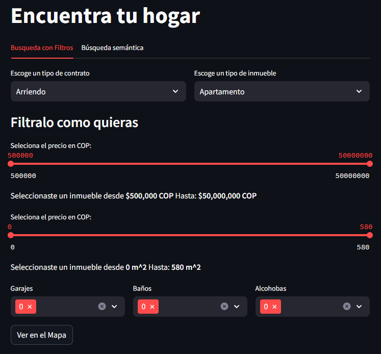

# Metrocuadrado Data Recollection Project

This project showcases the integration of Scrapy for web scraping with Streamlit for data visualization, focusing on real estate listings from the Metrocuadrado website. The final visualization is hosted on a HuggingFace space, providing users with interactive insights into the real estate market without the need for local setup.

## Project Overview

The goal of this project is to demonstrate the end-to-end process of Web Scrapping using only the Scrapy Framework:

### Main Directory (scrapper)

- **itemloaders**: Here is organized the itemloaders code that is used for preprocessing of the sraped data.
- **items**: The items file contains the definition of the items that are scrapped, this items are defined using native datacalsses from python.
- **middlewares**: Script the comes as default in the scrapy project but isn't used
- **piplines**: There are four piplines written in this script. After an Item is scrapped and loaded, the piplines file checks if it is a duplicated item. If it is, then it drops it. If not, then it checks if the item is in its apropiate table in the database and finally, it stores the item.
- **settings**: Here are the scrapy settings.

### Sub Diretory (spiders)
- **dicts**: Here are some dicts that are special for the spider, for example the custm settings and the headers and payloads for the requests that the spider does.
- **metrocuadrado**: The file contains the spider used to scarpe the data.

## Key Learnings

Throughout this project, significant knowledge was gained in several areas:

- **Web Scraping with Scrapy**: Techniques and strategies for efficient and effective data extraction from websites.
- **Python Programming**: Advanced Python concepts, especially related to data manipulation, database operations, and web application development.
- **SQLite Database**: Understanding of database management systems with a focus on SQLite for storing and managing scraped data.
- **Interactive Web Applications with Streamlit**: Skills in developing and deploying interactive data visualization tools, particularly leveraging the Streamlit framework.
- **Project Hosting on HuggingFace Spaces**: Experience with deploying and managing applications on HuggingFace's platform, enabling broad accessibility.

## Hosting on HuggingFace Spaces

The Streamlit application is available on HuggingFace spaces, providing an interactive interface to explore the real estate data. Users can filter, search, and visualize listings based on various criteria such as price, location, and property features directly within their web browser.

Access the application [here](https://huggingface.co/spaces/Don-Golo/MetroCuadrado)

  

## Contributions and Feedback

We welcome contributions, feedback, and suggestions to improve the application or extend its functionalities. Feel free to reach out through the project's repository on HuggingFace.

## License

This project is released under the MIT License. See the LICENSE file in the repository for full details.

---

For further information or to report issues, please contact the project maintainers via the project's HuggingFace repository.
