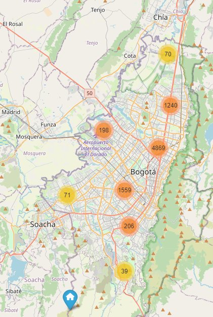

# Metro Cuadrado Scrapper

Este proyecto utiliza la libreria Scrapy para obtener datos georeferenciados de inmuebles presentes en la página www.metrocuadrado.com para la ciudad de Bogotá D.C.
El código se encarga de obtener los datos, procesarlos y almacenarlos en una base de datos de SQLite.
Antes de correr el código, es necesario tener instalado 

## HTML Output

[](MapPage/index.html)

Para clonar el projecto, utilizas la siguiente línea de comando: 

```sh
git clone
```
después, lo recomendable es crear un entorno virtual y activarlo. podemos utilizar las siguientes líneas de comando. Para ello, la siguiente l+inea de comando te creara un entorno virtual de python en una carpeta llamada ```.venv```. Aquí instalaremos las dependecias

```sh
python -m venv .venv
source .venv/bin/activate
```

Una vez activado el entorno virtual, lo siguiente es instalar las dependecias:
```sh
pip install -r requirements.txt
```

Con las dependecias listas, ya es posible correr los scripts de Scrapy, que permitira obtener la información de la web. Para ello, corremos

```sh
cd runScrapy
scrapy crawl MetroCuadrado
```
Ya con los datos cargados, podemos crear el mapa de los datos. Para ello, vamos a la carpeta ```MapPage``` y corremos el script que genera el mapa.
```sh
cd ../MapPage
python map_script.py
```
Ya con eso tenemos en el archivo ```index.html``` el mapa generado por nuestro web scrapping.
